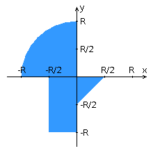

# Лабораторная работа №4

<h3>Внимание! У разных вариантов разный текст задания!</h3>

Переписать приложение из <a href="https://github.com/stepagin/web-lab-3">предыдущей лабораторной работы</a> с использованием следующих технологий:

<ul>
    <li>Уровень back-end должен быть основан на Spring.</li>
    <li>Уровень front-end должен быть построен на <a href="https://facebook.github.io/react/"
                                                     target="_blank">React</a> + <a
            href="http://redux.js.org/docs/basics/UsageWithReact.html" target="_blank">Redux</a> (необходимо
        использовать ES6 и JSX) с использованием набора компонентов <a href="https://github.com/primefaces/primereact"
                                                                       target="_blank">Primereact</a></li>
    <li>Взаимодействие между уровнями back-end и front-end должно быть организовано посредством REST API.</li>
</ul>

Приложение по-прежнему должно включать в себя 2 страницы - стартовую и основную страницу приложения. Обе страницы
    приложения должны быть адаптированы для отображения в 3 режимах:

<ul>
    <li>"Десктопный" - для устройств, ширина экрана которых равна или превышает 1234 пикселей.</li>
    <li>"Планшетный" - для устройств, ширина экрана которых равна или превышает 874, но меньше 1234 пикселей.</li>
    <li>"Мобильный"- для устройств, ширина экрана которых меньше 874 пикселей.</li>
</ul>

<b>Стартовая страница должна содержать следующие элементы:</b>

<ul>
    <li>"Шапку", содержащую ФИО студента, номер группы и номер варианта.</li>
    <li>Форму для ввода логина и пароля. Информация о зарегистрированных в системе пользователях должна храниться в
        отдельной таблице БД (пароль должен храниться в виде хэш-суммы). Доступ неавторизованных пользователей к
        основной странице приложения должен быть запрещён.
    </li>
</ul>

<b>Основная страница приложения должна содержать следующие элементы:</b>

<ul>
    <li>Набор полей ввода для задания координат точки и радиуса области в соответствии с вариантом задания: Button
        {'-3','-2','-1','0','1','2','3','4','5'} для координаты по оси X, Spinner (-3 ... 5) для координаты по оси
        Y, и Button {'-3','-2','-1','0','1','2','3','4','5'} для задания радиуса области. Если поле ввода допускает
        ввод заведомо некорректных данных (таких, например, как буквы в координатах точки или отрицательный радиус),
        то приложение должно осуществлять их валидацию.
    </li>
    <li>Динамически обновляемую картинку, изображающую область на координатной плоскости в соответствии с номером
        варианта и точки, координаты которых были заданы пользователем. Клик по картинке должен инициировать
        сценарий, осуществляющий определение координат новой точки и отправку их на сервер для проверки её попадания
        в область. Цвет точек должен зависить от факта попадания / непопадания в область. Смена радиуса также должна
        инициировать перерисовку картинки.
    </li>
    <li>Таблицу со списком результатов предыдущих проверок.</li>
    <li>Кнопку, по которой аутентифицированный пользователь может закрыть свою сессию и вернуться на стартовую
        страницу приложения.
    </li>
</ul>

<b>Дополнительные требования к приложению:</b>

<ul>
    <li>Все результаты проверки должны сохраняться в базе данных под управлением СУБД PostgreSQL.</li>
    <li>Для доступа к БД необходимо использовать Spring Data.</li>
</ul>

<strong>Вопросы к защите лабораторной работы:</strong>

<ol>
  <li>Платформа Java EE. Спецификации и их реализации.</li>
  <li>Принципы IoC, CDI и Location Transpanency. Компоненты и контейнеры.</li>
  <li>Управление жизненным циклом компонентов. Дескрипторы развёртывания.</li>
  <li>Java EE API. Виды компонентов. Профили платформы Java EE.</li>
  <li>Компоненты EJB. Stateless &amp; Stateful Session Beans. EJB Lite и EJB Full.</li>
  <li>Работа с электронной почтой в Java EE. JavaMail API.</li>
  <li>JMS. Реализация очередей сообщений. Способы доставки сообщений до клиента. Message-Driven Beans.</li>
  <li>Понятие транзакции. Управление транзакциями в Java EE. JTA.</li>
  <li>Веб-сервисы. Технологии JAX-RS и JAX-WS.</li>
  <li>Платформа Spring. Сходства и отличия с Java EE.</li>
  <li>Модули Spring. Архитектура Spring Runtime. Spring Security и Spring Data.</li>
  <li>Реализация IoC и CDI в Spring. Сходства и отличия с Java EE.</li>
  <li>Реализация REST API в Java EE и Spring.</li>
  <li>React JS. Архитектура и основные принципы разработки приложений.</li>
  <li>Компоненты React. State &amp; props. "Умные" и "глупые" компоненты.</li>
  <li>Разметка страниц в React-приложениях. JSX.</li>
  <li>Навигация в React-приложениях. ReactRouter.</li>
  <li>Управление состоянием интерфейса. Redux.</li>
  <li>Angular: архитектура и основные принципы разработки приложений.</li>
  <li>Angular: модули, компоненты, сервисы и DI.</li>
  <li>Angular: шаблоны страниц, жизненный цикл компонентов, подключение CSS.</li>
  <li>Angular: клиент-серверное взаимодействие, создание, отправка и валидация данных форм.</li>
</ol>
